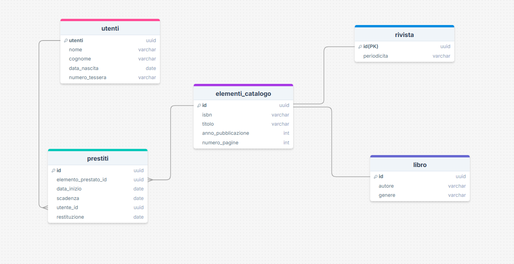
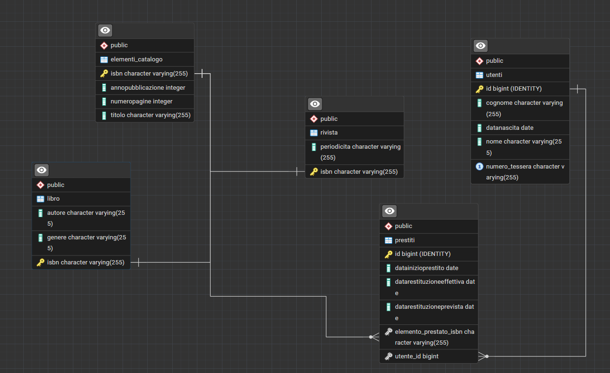

Libro/Rivista --- Elementi_catalogo (1:1) ho collegamento 1 a 1 tramite ereditarietà per estendere i dati base con quelli specifici.

Elementi_catalogo --- Prestiti (1:N): Un elemento del catalogo può comparire in più record di prestito nel tempo.

Utenti --- Prestiti (1:N): Un utente può avere molteplici record di prestito a lui associati.